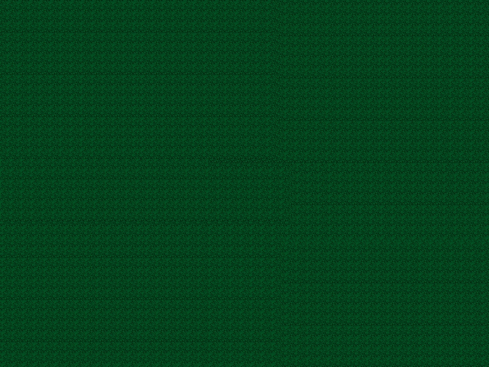
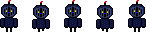
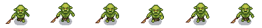
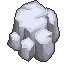

# Journtasy

A top-down 2D dungeon crawler built with Python and Pygame. Navigate procedurally generated dungeons, fight enemies, and grow stronger as you level up your chosen character.

---

## Environments

| Bricks | Grass | Dark Grass | Panel |
|--------|-------|------------|-------|
|  |  |  |  |

---

## Gameplay

- **Real-time combat** — Attack with left-click, move with WASD
- **Room exploration** — Walk off any screen edge to enter a new room
- **Character progression** — Defeat enemies to earn EXP and level up, scaling your health, damage, and armor
- **Pause / Resume** — Press `ESC` to pause at any time

---

## Features

### Characters
Choose from 6 playable characters, each with unique base stats and a dedicated weapon:

| Knight | Monk | Killer | Wizard | Boxer | Caveman |
|--------|------|--------|--------|-------|---------|
|  |  |  |  |  |  |

### Enemies
Three enemy tiers with escalating difficulty:

| Type 1 | Type 2 | Type 3 |
|--------|--------|--------|
|  |  |  |

Enemies patrol until aggroed, then chase and attack the player. Defeated enemies drop experience scaled to their type and level.

### Obstacles

| Obstacle 1 | Obstacle 2 | Obstacle 3 |
|------------|------------|------------|
|  |  |  |

### Dungeon Generation
- Rooms are procedurally generated and connected in all directions
- Each room contains randomly spawned enemies and obstacles
- Backgrounds are randomly selected from available variants
- Entities spawn with overlap avoidance

### Combat
- Melee weapon attacks triggered by left-click
- Armor reduces incoming damage
- Player has an invulnerability window after being hit
- Enemies have a cooldown between attacks

### HUD
- **Health bar** — Displayed above every character
- **Experience bar** — Shows progress toward the next level
- **Level indicator** — Visible on all entities
- **Stats panel** — Live display of player health, damage, and armor

---

## Getting Started

### Requirements
- Python 3.14
- [Pygame](https://pypi.org/project/pygame-ce/)

```bash
pip install pygame-ce
```

### Run

```bash
python main.py
```

---

## Controls

| Action       | Input       |
|--------------|-------------|
| Move         | `W A S D`   |
| Attack       | Left click  |
| Pause/Resume | `ESC`       |

---

## Architecture Highlights

- **Inheritance chain:** `Entity → AnimatedEntity → Character → Player / Enemy`
- **Manager pattern:** Dedicated managers for scenes, dungeon state, collisions, assets, and input
- **Stat system:** Modular `Health`, `Damage`, and `Armor` classes with level-scaling growth formulas
- **Generator pattern:** Each content type (enemies, obstacles, backgrounds) has its own generator
- **Centralized config:** All tunable values live in `scripts/config/constants.py`
